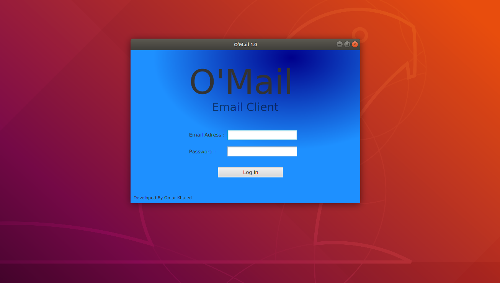

# O'Mail

A Simple Email Client which do some basic functionalities

## Features

- User can receive emails

- User can compose emails

- User can change state of reading of the emails

## Requirements

- Java SE Runtime

## Project API

- [JavaMailAPI](http://www.oracle.com/technetwork/java/javamail/index.html)

